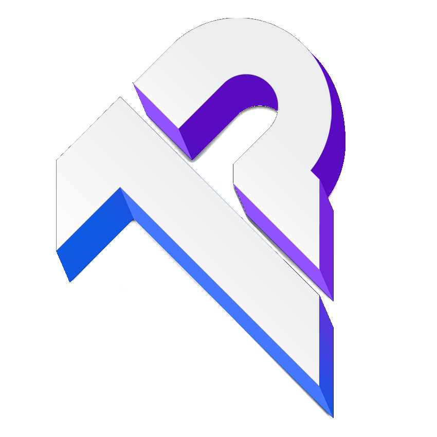

<p align="center">
  
</p>
<h1 align="center">Project One Companion</h1>
<p align="center">A desktop application built with Electron, Vite, and React to help World of Warcraft guild leaders manage their roster, raid attendance, and loot distribution.</p>


## Features
- **Roster Management**: Track guild members, their roles, classes, and specializations
- **Droptimizers Tracker**: Track RaidBots' droptimizers results to show the DPS upgrades for each member
- **BiS List Tracker**: Track a customizable BiS List for each specialization
- **Raid Sessions**: Create and schedule raid events with automatic role composition checks
- **Loot Tracking**: Record and distribute raid loot with customizable loot systems
- **Tier Set Management**: Track tier set pieces of each member over multiple pages, making it easier to manage tier set assignments

## Getting Started
### Prerequisites
- Node.js (v20+)
- pnpm

## Recommended IDE Setup
- VSCode
- See `.vscode/extensions.json` for recommended extensions

## Project Setup
### Install
```bash
$ pnpm install
```

### Development
```bash
$ pnpm dev
```

### Build
```bash
# For windows
$ pnpm build:win

# For macOS
$ pnpm build:mac

# For Linux
$ pnpm build:linux
```

## Tech Stack
- **Electron**: Cross-platform desktop app framework
- **Vite**: Next-generation frontend build tool
- **React**: UI library
- **TypeScript**: Type-safe JavaScript
- **Electron Store**: Persistent data storage
